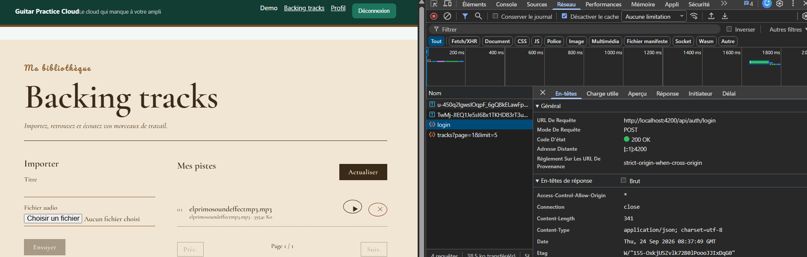
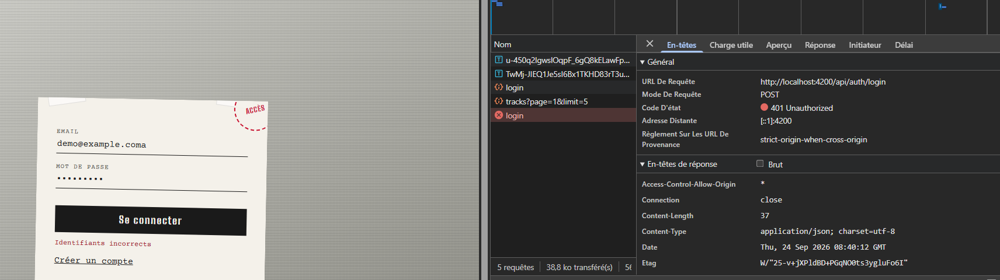
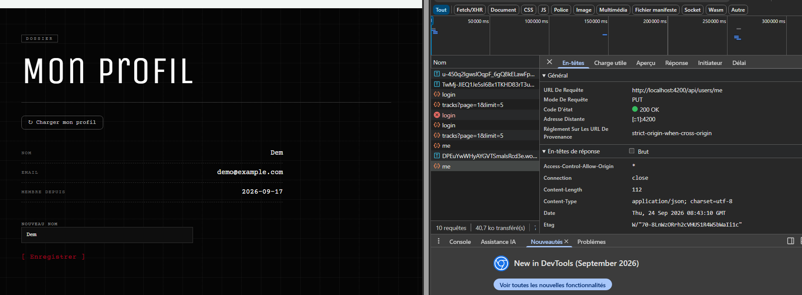

# Rapport d'usage de l'IA - TP1

Pour chaque mission, détailler et fournir des explications concernant : objectif; prompt principal; plan proposé par l'agent; vérifications réalisées par le binôme; erreurs ou propositions rejetées; fichiers effectivement modifiés; preuve de fonctionnement; ce que chaque membre sait maintenant expliquer sans l'agent.

**Assistant utilisé :** Claude Code, modèle Claude Sonnet 5 (`claude-sonnet-5`).

## Mission 0 — Cartographier l'application

**Objectif.** Repérer sans modifier de code le composant racine, la config des routes, l'enregistrement de `HttpClient`, les modèles/services/pages, et le mécanisme d'ajout du JWT ; produire un schéma annoté du flux de connexion et distinguer les routes publiques des routes protégées.

**Prompt principal.** « Explique de manière simple mais bonne et complète l'utilité de chacun des fichiers de l'application en backend et frontend ainsi que leur contenu » puis « fais ça dans un fichier .html à la racine qui se nomme schema-reponse-td1 ».

**Plan proposé par l'agent.** Lecture exhaustive des fichiers backend (`server.js`, `app.js`, `models/User.js`, `models/Track.js`) et frontend (`main.ts`, `routes.ts`, `app.ts`, les 4 pages, les services, le guard, l'intercepteur, les modèles), croisement avec `API_CONTRACT.md`, puis rédaction d'un document HTML autonome avec : architecture générale, schéma pas-à-pas du clic « Se connecter », tableau routes publiques/protégées, tableau fichier-par-fichier backend, tableau fichier-par-fichier frontend.

**Vérifications réalisées.** Comparaison manuelle des routes déclarées dans `app.js` avec celles listées dans `API_CONTRACT.md` ; vérification de la cible `http://localhost:3000` dans `proxy.conf.json` ; relecture du fichier HTML généré pour confirmer qu'il s'ouvre correctement dans un navigateur (aucune dépendance externe).

**Erreurs ou propositions rejetées.** Aucune : cette mission est restée en lecture seule, conformément à la consigne « sans modifier le code au début ».

**Fichiers effectivement modifiés.** Création de `schema-reponse-td1.html` (commit `052159e`), complété plus tard (commit `ff9314a`) avec les réponses aux questions posées dans le sujet Mission 1 (modèle IA utilisé, routes réellement appelées, emplacement de la mise à jour du profil).

**Preuve de fonctionnement.** `schema-reponse-td1.html` s'ouvre en local (double-clic) et affiche le schéma complet ; capture d'écran à ajouter par le binôme dans `preuves/` (voir section Captures ci-dessous).

**Ce que chaque membre sait maintenant expliquer sans l'agent.**
- Le trajet exact d'une requête de connexion : `login-page.html` → `LoginPageComponent.submit()` → `AuthService.login()` → `authInterceptor` (aucun header au premier login) → `proxy.conf.json` → Express `POST /api/auth/login` → `User.findOne` + `bcrypt.compare` (Mongoose/MongoDB) → réponse `{token, user}` → `storeAuthentication()` (signals + `localStorage`) → `router.navigateByUrl('/tracks')` → `authGuard`.
- Pourquoi Angular ne parle jamais directement à MongoDB (tout passe par l'API Express).
- La différence entre routes publiques (`/health`, `/auth/register`, `/auth/login`) et protégées (tout le reste, JWT requis).

## Mission 1 — Inscription, Connexion et Profil

**Objectif.** Compléter la partie utilisateur du frontend : formulaires réactifs, validations lisibles, appels `/api/auth/register` et `/api/auth/login`, JWT jamais loggé, signal `currentUser`, redirections, déconnexion avec nettoyage d'état, chargement/mise à jour de `/api/users/me`, gestion d'un `401`.

**Prompt principal.** « On va planifier ça, on va coder de manière simple, qui fonctionne, étape par étape tu me demandes quoi faire de préférence, fais juste ce qui est demandé [...] Un commit par feature. »

**Plan proposé par l'agent** (mode Plan, fichier `mission-1-inscription-playful-lynx.md`). Audit du code existant point par point : la plupart des exigences étaient déjà en place (formulaires, appels API, stockage du JWT, signal `currentUser`, redirections, `PUT /api/users/me`). Quatre lacunes réelles ont été identifiées et proposées comme 4 commits distincts :
1. Messages de validation par champ (email invalide, mot de passe trop court) — absents jusque-là.
2. Bouton de déconnexion + nav dynamique — `AuthService.logout()` existait mais n'était appelé nulle part.
3. Chargement automatique du profil à l'arrivée sur `/profile` — nécessitait un clic manuel.
4. Gestion du `401` dans l'intercepteur — l'intercepteur ajoutait le token mais n'interceptait aucune erreur.

L'ordre proposé a été confirmé par le binôme (option « ordre du plan »).

**Vérifications réalisées** (dans le navigateur, backend + `ng serve` lancés, à chaque commit) :
- Formulaires : un champ invalide affiche le message correspondant et désactive le bouton de soumission.
- Déconnexion : clic sur « Déconnexion » → redirection `/login`, `localStorage` vidé, nav revenue à l'état déconnecté.
- Profil : navigation directe vers `/profile` après connexion → les informations s'affichent sans clic.
- 401 : injection d'un token invalide via `localStorage.setItem('gpc_token', 'token-invalide')` puis navigation vers `/profile` → déconnexion automatique et redirection vers `/login` (vérifié via `localStorage.getItem('gpc_token') === null` après coup).

**Erreurs ou propositions rejetées.**
- Premier essai de condition d'affichage de la nav sur `auth.currentUser()` : rejeté, car ce signal n'est peuplé qu'après un appel réseau explicite (`login()`/`profile()`), donc un rechargement de page avec un token déjà en `localStorage` aurait affiché « Connexion » à tort. Remplacé par `auth.token()`, qui reflète l'état de session réellement restauré au démarrage.
- Connexion MongoDB Atlas tombée en cours de séance (`MongooseServerSelectionError`, `ETIMEDOUT` sur les 3 nœuds du cluster) alors que la whitelist IP (`0.0.0.0/0`) était pourtant correcte. Diagnostic réseau (`Test-NetConnection` sur le port 27017 puis 443) montrant un échec TCP même sur un port générique vers cette IP précise : pointait vers un problème réseau local/transitoire plutôt qu'un souci de whitelist Atlas. Le backend a fini par se reconnecter seul ; aucun code applicatif n'a été modifié pour ce problème d'infrastructure.

**Fichiers effectivement modifiés.**
`login-page.html`, `register-page.ts`/`.html`, `profile-page.ts`/`.html`, `app.ts`/`.html`, `auth.interceptor.ts`, `styles.css` — commits `1f1ee91`, `7c4b858`, `57222c5`, `50b84ae`.

**Preuve de fonctionnement.**
- `curl -X POST http://localhost:3000/api/auth/login -d '{"email":"demo@example.com","password":"Demo1234!"}'` → `200 {token, user}`.
- Captures d'écran prises pendant la session : formulaire avec message « Email invalide » et bouton désactivé ; nav avec bouton « Déconnexion » après connexion ; page profil chargée automatiquement (nom, email, date affichés sans clic) ; console navigateur confirmant `{token: null, url: "http://localhost:4200/login"}` après simulation d'un token invalide.
- Captures à ajouter par le binôme dans `preuves/` pour le Checkpoint Network (voir ci-dessous).

**Ce que chaque membre sait maintenant expliquer sans l'agent.**
- Pourquoi l'intercepteur ne distingue pas route publique/protégée : il ajoute simplement le header `Authorization` si un token existe en mémoire, peu importe la route.
- Pourquoi le guard (`auth.guard.ts`) ne vérifie que la *présence* du token, jamais sa validité — et pourquoi c'est donc l'intercepteur (pas le guard) qui doit gérer le `401` en cas de token expiré/invalide.
- La différence entre le signal `token`/`currentUser` (état réactif en mémoire, lu par les templates) et `localStorage` (persistance brute entre rechargements de page) — voir aussi `schema-reponse-td1.html`, section 7.
- Le chemin complet de la mise à jour du profil : `profile-page.html` (formulaire) → `profile-page.ts` (`save()`) → `auth.service.ts` (`update()`, `PUT /api/users/me`) → `app.js` (route protégée par le middleware `auth`) → `User.findByIdAndUpdate` → `toPublic()`.

## Ajustements complémentaires (hors sujet strict du TP)

Demandés par l'étudiant en plus des missions, journalisés ici à sa demande explicite (« chaque chose qu'on fait on incrémente RAPPORT_IA_MODELE.md »).

### Thèmes visuels par page

**Objectif.** Donner à chaque page (login, register, profile, tracks) une identité visuelle distincte inspirée d'un groupe de rock (Rage Against the Machine, Queens of the Stone Age, Metallica, Fleetwood Mac), sans reproduire d'œuvre protégée.

**Prompt principal.** « tu vas faire un theme orienté rock [...] Une page par theme », puis, après une première version jugée trop générique : « déjà ils doivent prendre toute la page, ils doivent être plus originaux [...] on dirait directement que c'est fait par ia ».

**Plan proposé par l'agent.** Une clarification préalable (`AskUserQuestion`) a fixé la répartition (1 thème = 1 page) et le niveau d'exigence visuelle (couleurs/typo puis, sur demande, textures/bordures/effets poussés). Une itération intermédiaire a utilisé les pochettes d'albums envoyées par l'étudiant comme référence de palette — refusé de les reproduire telles quelles (droit d'auteur sur l'artwork, photo de personnes réelles pour la pochette Fleetwood Mac) et proposé à la place des couleurs dominantes adaptées. Sur retour « pas assez originales / trop plein écran manquant », réécriture complète : mise en page plein écran (technique CSS `width:100vw; left:50%; margin-left:-50vw`), compositions asymétriques et éditoriales bespoke par page (flyer photocopié avec scotch/tampon pour RATM, champ rouge tranché par un éclat noir pour QOTSA, fiche technique brutaliste à grille millimétrée pour Metallica, pochette vinyle avec tracklist numérotée pour Fleetwood Mac), avec des polices Google Fonts moins vues (Big Shoulders Stencil, Courier Prime, Rye, Archivo Narrow, Unica One, Cormorant Garamond, Pacifico) plutôt que les choix par défaut (Bebas Neue/Oswald/Metal Mania) de la première tentative.

**Vérifications réalisées.** Capture d'écran de chaque page dans le navigateur après chaque réécriture ; test responsive mobile (375×812) sur la page login pour confirmer le repli de la mise en page ; vérification que le rechargement à chaud (HMR) reflétait bien les nouveaux templates.

**Erreurs ou propositions rejetées.**
- Bug découvert en testant Tracks : le `<header class="sleeve-head">` héritait du style CSS global `header { background:#123d32 }` prévu pour la nav du site (sélecteur d'élément, pas de classe) — corrigé en renommant la balise en `<div>`.
- Deux tentatives de tester le profil et les pistes ont échoué car le backend s'était arrêté entre-temps (voir Mission 1, même souci Atlas/MongoDB) ; redémarré manuellement à chaque fois avant de reprendre les vérifications visuelles.

**Fichiers effectivement modifiés.** `index.html` (polices), `styles.css`, les 4 paires `*-page.html`/`*-page.css` — commits `e6a6d65`, `a3405a4`, `502a6b1`, `520bbe2`, `124124c` (première version) puis `818445b`, `678de3a`, `aa2cdfc`, `f167a76` (réécriture plein écran).

**Preuve de fonctionnement.** Captures d'écran prises pendant la session pour les 4 pages, en desktop et (pour login) en mobile ; à ajouter par le binôme dans `preuves/` si besoin pour la soutenance.

**Ce que chaque membre sait maintenant expliquer sans l'agent.**
- La technique de « full-bleed » en CSS (`width:100vw` + décalage négatif de la moitié de la largeur) pour faire déborder un composant du conteneur centré `<main>` sans toucher au routeur ni à la logique Angular.
- Pourquoi un sélecteur d'élément global (`header { ... }` dans `styles.css`) peut entrer en collision avec un élément du même nom utilisé ailleurs dans l'app, et pourquoi préférer une balise neutre (`div`) quand une classe suffit à cibler le style.
- Que l'habillage visuel (CSS) est strictement découplé de la logique métier : aucun fichier `.ts` de service, guard ou intercepteur n'a été modifié pour ces thèmes, seuls les composants de page et leurs templates/styles.

### Nom de l'utilisateur connecté dans la nav

**Objectif.** Afficher le nom de l'utilisateur connecté dans le header, à gauche du lien « Backing tracks », y compris juste après un rechargement de page.

**Prompt principal.** « j'aimerais quand on est connecté en haut a droite à gauche de backing track on ai juste le nom de l'utilisateur connecté ».

**Plan proposé par l'agent.** Ajout d'un `@if (auth.currentUser(); as user)` dans `app.html` juste avant le lien « Backing tracks ». Comme le signal `currentUser` n'est peuplé qu'après un appel réseau explicite (voir Mission 1), un rechargement de page avec un token déjà stocké l'aurait laissé vide : ajout dans le constructeur d'`AppComponent` d'un appel `auth.profile()` déclenché uniquement si un token existe mais qu'aucun `currentUser` n'est encore chargé.

**Vérifications réalisées.** Rechargement complet de la page sur `/tracks` avec une session déjà active (token en `localStorage`) → le nom « Demo » apparaît bien dans la nav sans navigation manuelle vers `/profile`.

**Erreurs ou propositions rejetées.** Aucune : première implémentation validée directement, car elle réutilise le pattern déjà en place dans `profile-page.ts` (appel de `load()`/`profile()` dans le constructeur).

**Fichiers effectivement modifiés.** `app.ts`, `app.html`, `app.css` — commit `925f431`.

**Preuve de fonctionnement.** Capture d'écran de la nav sur `/tracks` après rechargement, montrant « Demo » avant « Backing tracks ».

**Ce que chaque membre sait maintenant expliquer sans l'agent.**
- Pourquoi il fallait un appel `profile()` explicite au démarrage de l'app (et pas seulement lire `localStorage`) : `currentUser` est un Signal en mémoire, jamais désérialisé automatiquement depuis `localStorage` (seul le `token`, une simple chaîne, l'est).
- Pourquoi ce correctif se place dans `AppComponent` (le composant racine, toujours instancié une fois) plutôt que dans chaque page.

### Suppression d'une piste

**Objectif.** Ajouter un bouton pour supprimer une piste audio uploadée, en s'appuyant sur la route bonus `DELETE /api/tracks/:id` déjà présente côté backend (`app.js`) mais jamais appelée par le frontend.

**Prompt principal.** « rajoute un bouton pour supprimer les tracks qu'on a rajouté ».

**Plan proposé par l'agent.** Ajout d'une méthode `remove(id)` dans `TrackService` (nouvel appel `HttpClient.delete`), d'une méthode `remove(track)` dans `TracksPageComponent` (confirmation via `confirm()` puis rechargement de la liste après succès), et d'un bouton « ✕ » à côté du bouton lecture dans le template, stylé dans la continuité du thème Fleetwood Mac de la page.

**Vérifications réalisées.** Backend et frontend relancés (les deux s'étaient à nouveau arrêtés) ; clic sur « ✕ » d'une piste avec confirmation acceptée → la piste disparaît de la liste (passage de 3 à 2 pistes), sans rechargement manuel de page. Le `confirm()` natif du navigateur a été vérifié séparément (annuler = aucune requête réseau envoyée) avant de valider le scénario d'acceptation.

**Erreurs ou propositions rejetées.** Aucune : la route backend existait déjà et documentée dans `API_CONTRACT.md`, seule la partie frontend manquait.

**Fichiers effectivement modifiés.** `track.service.ts`, `tracks-page.ts`, `tracks-page.html`, `tracks-page.css` — commit `068f07f`.

**Preuve de fonctionnement.** Liste de pistes passant de 3 à 2 éléments après confirmation, sans erreur console ; requête `DELETE /api/tracks/:id` suivie d'un nouvel appel `GET /api/tracks` (rechargement automatique de la liste).

**Ce que chaque membre sait maintenant expliquer sans l'agent.**
- Pourquoi ce bouton n'existait pas avant : la route existait côté API (marquée « bonus » dans `API_CONTRACT.md`) mais aucun composant ne l'appelait — un exemple concret de fonctionnalité backend prête mais non exposée côté interface.
- Le rôle de `confirm()` comme garde-fou minimal avant une action destructive, et pourquoi on recharge la liste (`load()`) après succès plutôt que de retirer l'élément manuellement du tableau local.

## Captures à ajouter par le binôme

Le Checkpoint du sujet demande des captures Network (méthode, URL, corps JSON, statut, réponse, présence de `Authorization`) — **sans jamais capturer un mot de passe ou un JWT en clair**. À ajouter dans un dossier `preuves/` à la racine du projet, puis à lier ici :

```markdown



```
