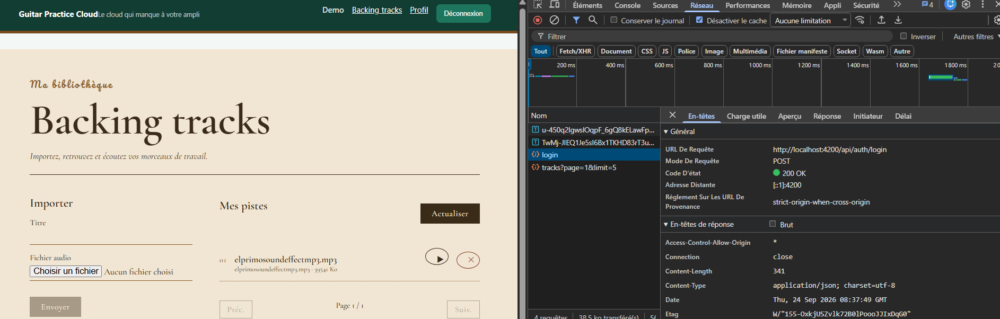
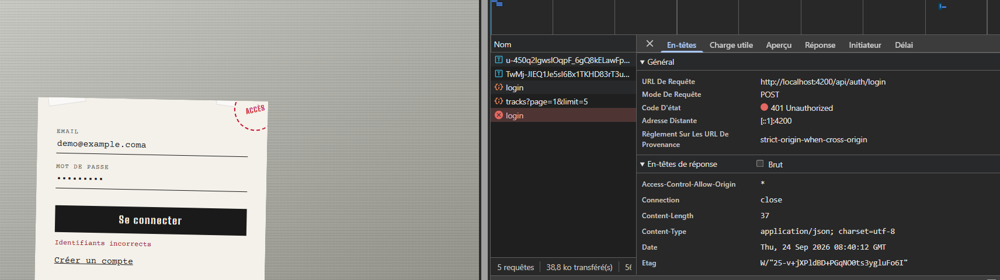
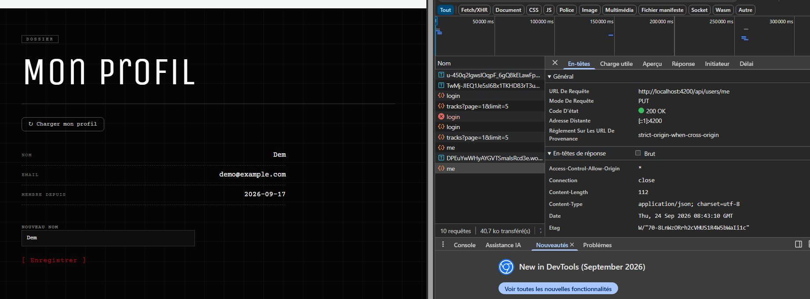
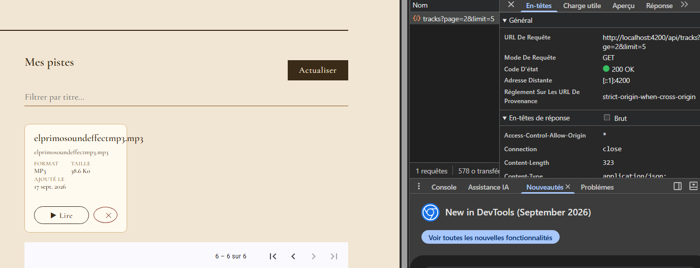
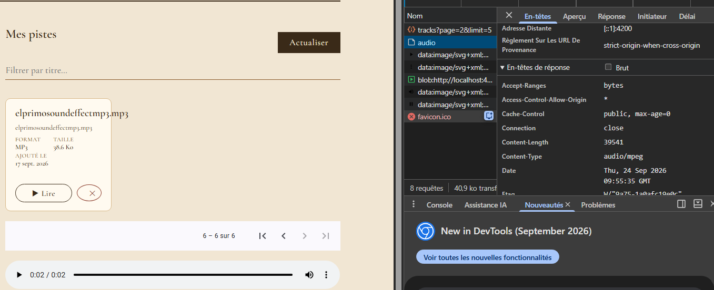

# Rapport d'usage de l'IA - TP1

Pour chaque mission, détailler et fournir des explications concernant : objectif; prompt principal; plan proposé par l'agent; vérifications réalisées par le binôme; erreurs ou propositions rejetées; fichiers effectivement modifiés; preuve de fonctionnement; ce que chaque membre sait maintenant expliquer sans l'agent.

**Assistant utilisé :** Claude Code, modèle Claude Sonnet 5 (`claude-sonnet-5`).

## Mission 0 — Cartographier l'application

**Objectif.** Repérer sans modifier de code le composant racine, la config des routes, l'enregistrement de `HttpClient`, les modèles/services/pages, et le mécanisme d'ajout du JWT ; produire un schéma annoté du flux de connexion et distinguer les routes publiques des routes protégées.

**Prompt principal.** « Explique de manière simple mais bonne et complète l'utilité de chacun des fichiers de l'application en backend et frontend ainsi que leur contenu » puis « fais ça dans un fichier .html à la racine qui se nomme schema-reponse-td1 ».

**Plan proposé par l'agent.** Lecture exhaustive des fichiers backend (`server.js`, `app.js`, `models/User.js`, `models/Track.js`) et frontend (`main.ts`, `routes.ts`, `app.ts`, les 4 pages, les services, le guard, l'intercepteur, les modèles), croisement avec `API_CONTRACT.md`, puis rédaction d'un document HTML autonome avec : architecture générale, schéma pas-à-pas du clic « Se connecter », tableau routes publiques/protégées, tableau fichier-par-fichier backend, tableau fichier-par-fichier frontend.

**Vérifications réalisées.** Comparaison manuelle des routes déclarées dans `app.js` avec celles listées dans `API_CONTRACT.md` ; vérification de la cible `http://localhost:3000` dans `proxy.conf.json` ; relecture du fichier HTML généré pour confirmer qu'il s'ouvre correctement dans un navigateur (aucune dépendance externe).

**Erreurs ou propositions rejetées.** Aucune : cette mission est restée en lecture seule, conformément à la consigne « sans modifier le code au début ».

**Fichiers effectivement modifiés.** Création de `schema-reponse-td1.html` (commit `052159e`), complété plus tard (commit `ff9314a`) avec les réponses aux questions posées dans le sujet Mission 1 (modèle IA utilisé, routes réellement appelées, emplacement de la mise à jour du profil).

**Preuve de fonctionnement.** `schema-reponse-td1.html` s'ouvre en local (double-clic) et affiche le schéma complet ; capture d'écran à ajouter par le binôme dans `preuves/` (voir section Captures ci-dessous).

**Ce que chaque membre sait maintenant expliquer sans l'agent.**
- Le trajet exact d'une requête de connexion : `login-page.html` → `LoginPageComponent.submit()` → `AuthService.login()` → `authInterceptor` (aucun header au premier login) → `proxy.conf.json` → Express `POST /api/auth/login` → `User.findOne` + `bcrypt.compare` (Mongoose/MongoDB) → réponse `{token, user}` → `storeAuthentication()` (signals + `localStorage`) → `router.navigateByUrl('/tracks')` → `authGuard`.
- Pourquoi Angular ne parle jamais directement à MongoDB (tout passe par l'API Express).
- La différence entre routes publiques (`/health`, `/auth/register`, `/auth/login`) et protégées (tout le reste, JWT requis).

## Mission 1 — Inscription, Connexion et Profil

**Objectif.** Compléter la partie utilisateur du frontend : formulaires réactifs, validations lisibles, appels `/api/auth/register` et `/api/auth/login`, JWT jamais loggé, signal `currentUser`, redirections, déconnexion avec nettoyage d'état, chargement/mise à jour de `/api/users/me`, gestion d'un `401`.

**Prompt principal.** « On va planifier ça, on va coder de manière simple, qui fonctionne, étape par étape tu me demandes quoi faire de préférence, fais juste ce qui est demandé [...] Un commit par feature. »

**Plan proposé par l'agent** (mode Plan, fichier `mission-1-inscription-playful-lynx.md`). Audit du code existant point par point : la plupart des exigences étaient déjà en place (formulaires, appels API, stockage du JWT, signal `currentUser`, redirections, `PUT /api/users/me`). Quatre lacunes réelles ont été identifiées et proposées comme 4 commits distincts :
1. Messages de validation par champ (email invalide, mot de passe trop court) — absents jusque-là.
2. Bouton de déconnexion + nav dynamique — `AuthService.logout()` existait mais n'était appelé nulle part.
3. Chargement automatique du profil à l'arrivée sur `/profile` — nécessitait un clic manuel.
4. Gestion du `401` dans l'intercepteur — l'intercepteur ajoutait le token mais n'interceptait aucune erreur.

L'ordre proposé a été confirmé par le binôme (option « ordre du plan »).

**Vérifications réalisées** (dans le navigateur, backend + `ng serve` lancés, à chaque commit) :
- Formulaires : un champ invalide affiche le message correspondant et désactive le bouton de soumission.
- Déconnexion : clic sur « Déconnexion » → redirection `/login`, `localStorage` vidé, nav revenue à l'état déconnecté.
- Profil : navigation directe vers `/profile` après connexion → les informations s'affichent sans clic.
- 401 : injection d'un token invalide via `localStorage.setItem('gpc_token', 'token-invalide')` puis navigation vers `/profile` → déconnexion automatique et redirection vers `/login` (vérifié via `localStorage.getItem('gpc_token') === null` après coup).

**Erreurs ou propositions rejetées.**
- Premier essai de condition d'affichage de la nav sur `auth.currentUser()` : rejeté, car ce signal n'est peuplé qu'après un appel réseau explicite (`login()`/`profile()`), donc un rechargement de page avec un token déjà en `localStorage` aurait affiché « Connexion » à tort. Remplacé par `auth.token()`, qui reflète l'état de session réellement restauré au démarrage.
- Connexion MongoDB Atlas tombée en cours de séance (`MongooseServerSelectionError`, `ETIMEDOUT` sur les 3 nœuds du cluster) alors que la whitelist IP (`0.0.0.0/0`) était pourtant correcte. Diagnostic réseau (`Test-NetConnection` sur le port 27017 puis 443) montrant un échec TCP même sur un port générique vers cette IP précise : pointait vers un problème réseau local/transitoire plutôt qu'un souci de whitelist Atlas. Le backend a fini par se reconnecter seul ; aucun code applicatif n'a été modifié pour ce problème d'infrastructure.

**Fichiers effectivement modifiés.**
`login-page.html`, `register-page.ts`/`.html`, `profile-page.ts`/`.html`, `app.ts`/`.html`, `auth.interceptor.ts`, `styles.css` — commits `1f1ee91`, `7c4b858`, `57222c5`, `50b84ae`.

**Preuve de fonctionnement.**
- `curl -X POST http://localhost:3000/api/auth/login -d '{"email":"demo@example.com","password":"Demo1234!"}'` → `200 {token, user}`.
- Captures d'écran prises pendant la session : formulaire avec message « Email invalide » et bouton désactivé ; nav avec bouton « Déconnexion » après connexion ; page profil chargée automatiquement (nom, email, date affichés sans clic) ; console navigateur confirmant `{token: null, url: "http://localhost:4200/login"}` après simulation d'un token invalide.
- Captures à ajouter par le binôme dans `preuves/` pour le Checkpoint Network (voir ci-dessous).

**Ce que chaque membre sait maintenant expliquer sans l'agent.**
- Pourquoi l'intercepteur ne distingue pas route publique/protégée : il ajoute simplement le header `Authorization` si un token existe en mémoire, peu importe la route.
- Pourquoi le guard (`auth.guard.ts`) ne vérifie que la *présence* du token, jamais sa validité — et pourquoi c'est donc l'intercepteur (pas le guard) qui doit gérer le `401` en cas de token expiré/invalide.
- La différence entre le signal `token`/`currentUser` (état réactif en mémoire, lu par les templates) et `localStorage` (persistance brute entre rechargements de page) — voir aussi `schema-reponse-td1.html`, section 7.
- Le chemin complet de la mise à jour du profil : `profile-page.html` (formulaire) → `profile-page.ts` (`save()`) → `auth.service.ts` (`update()`, `PUT /api/users/me`) → `app.js` (route protégée par le middleware `auth`) → `User.findByIdAndUpdate` → `toPublic()`.

## Ajustements complémentaires (hors sujet strict du TP)

Demandés par l'étudiant en plus des missions, journalisés ici à sa demande explicite (« chaque chose qu'on fait on incrémente RAPPORT_IA_MODELE.md »).

### Thèmes visuels par page

**Objectif.** Donner à chaque page (login, register, profile, tracks) une identité visuelle distincte inspirée d'un groupe de rock (Rage Against the Machine, Queens of the Stone Age, Metallica, Fleetwood Mac), sans reproduire d'œuvre protégée.

**Prompt principal.** « tu vas faire un theme orienté rock [...] Une page par theme », puis, après une première version jugée trop générique : « déjà ils doivent prendre toute la page, ils doivent être plus originaux [...] on dirait directement que c'est fait par ia ».

**Plan proposé par l'agent.** Une clarification préalable (`AskUserQuestion`) a fixé la répartition (1 thème = 1 page) et le niveau d'exigence visuelle (couleurs/typo puis, sur demande, textures/bordures/effets poussés). Une itération intermédiaire a utilisé les pochettes d'albums envoyées par l'étudiant comme référence de palette — refusé de les reproduire telles quelles (droit d'auteur sur l'artwork, photo de personnes réelles pour la pochette Fleetwood Mac) et proposé à la place des couleurs dominantes adaptées. Sur retour « pas assez originales / trop plein écran manquant », réécriture complète : mise en page plein écran (technique CSS `width:100vw; left:50%; margin-left:-50vw`), compositions asymétriques et éditoriales bespoke par page (flyer photocopié avec scotch/tampon pour RATM, champ rouge tranché par un éclat noir pour QOTSA, fiche technique brutaliste à grille millimétrée pour Metallica, pochette vinyle avec tracklist numérotée pour Fleetwood Mac), avec des polices Google Fonts moins vues (Big Shoulders Stencil, Courier Prime, Rye, Archivo Narrow, Unica One, Cormorant Garamond, Pacifico) plutôt que les choix par défaut (Bebas Neue/Oswald/Metal Mania) de la première tentative.

**Vérifications réalisées.** Capture d'écran de chaque page dans le navigateur après chaque réécriture ; test responsive mobile (375×812) sur la page login pour confirmer le repli de la mise en page ; vérification que le rechargement à chaud (HMR) reflétait bien les nouveaux templates.

**Erreurs ou propositions rejetées.**
- Bug découvert en testant Tracks : le `<header class="sleeve-head">` héritait du style CSS global `header { background:#123d32 }` prévu pour la nav du site (sélecteur d'élément, pas de classe) — corrigé en renommant la balise en `<div>`.
- Deux tentatives de tester le profil et les pistes ont échoué car le backend s'était arrêté entre-temps (voir Mission 1, même souci Atlas/MongoDB) ; redémarré manuellement à chaque fois avant de reprendre les vérifications visuelles.

**Fichiers effectivement modifiés.** `index.html` (polices), `styles.css`, les 4 paires `*-page.html`/`*-page.css` — commits `e6a6d65`, `a3405a4`, `502a6b1`, `520bbe2`, `124124c` (première version) puis `818445b`, `678de3a`, `aa2cdfc`, `f167a76` (réécriture plein écran).

**Preuve de fonctionnement.** Captures d'écran prises pendant la session pour les 4 pages, en desktop et (pour login) en mobile ; à ajouter par le binôme dans `preuves/` si besoin pour la soutenance.

**Ce que chaque membre sait maintenant expliquer sans l'agent.**
- La technique de « full-bleed » en CSS (`width:100vw` + décalage négatif de la moitié de la largeur) pour faire déborder un composant du conteneur centré `<main>` sans toucher au routeur ni à la logique Angular.
- Pourquoi un sélecteur d'élément global (`header { ... }` dans `styles.css`) peut entrer en collision avec un élément du même nom utilisé ailleurs dans l'app, et pourquoi préférer une balise neutre (`div`) quand une classe suffit à cibler le style.
- Que l'habillage visuel (CSS) est strictement découplé de la logique métier : aucun fichier `.ts` de service, guard ou intercepteur n'a été modifié pour ces thèmes, seuls les composants de page et leurs templates/styles.

### Nom de l'utilisateur connecté dans la nav

**Objectif.** Afficher le nom de l'utilisateur connecté dans le header, à gauche du lien « Backing tracks », y compris juste après un rechargement de page.

**Prompt principal.** « j'aimerais quand on est connecté en haut a droite à gauche de backing track on ai juste le nom de l'utilisateur connecté ».

**Plan proposé par l'agent.** Ajout d'un `@if (auth.currentUser(); as user)` dans `app.html` juste avant le lien « Backing tracks ». Comme le signal `currentUser` n'est peuplé qu'après un appel réseau explicite (voir Mission 1), un rechargement de page avec un token déjà stocké l'aurait laissé vide : ajout dans le constructeur d'`AppComponent` d'un appel `auth.profile()` déclenché uniquement si un token existe mais qu'aucun `currentUser` n'est encore chargé.

**Vérifications réalisées.** Rechargement complet de la page sur `/tracks` avec une session déjà active (token en `localStorage`) → le nom « Demo » apparaît bien dans la nav sans navigation manuelle vers `/profile`.

**Erreurs ou propositions rejetées.** Aucune : première implémentation validée directement, car elle réutilise le pattern déjà en place dans `profile-page.ts` (appel de `load()`/`profile()` dans le constructeur).

**Fichiers effectivement modifiés.** `app.ts`, `app.html`, `app.css` — commit `925f431`.

**Preuve de fonctionnement.** Capture d'écran de la nav sur `/tracks` après rechargement, montrant « Demo » avant « Backing tracks ».

**Ce que chaque membre sait maintenant expliquer sans l'agent.**
- Pourquoi il fallait un appel `profile()` explicite au démarrage de l'app (et pas seulement lire `localStorage`) : `currentUser` est un Signal en mémoire, jamais désérialisé automatiquement depuis `localStorage` (seul le `token`, une simple chaîne, l'est).
- Pourquoi ce correctif se place dans `AppComponent` (le composant racine, toujours instancié une fois) plutôt que dans chaque page.

### Suppression d'une piste

**Objectif.** Ajouter un bouton pour supprimer une piste audio uploadée, en s'appuyant sur la route bonus `DELETE /api/tracks/:id` déjà présente côté backend (`app.js`) mais jamais appelée par le frontend.

**Prompt principal.** « rajoute un bouton pour supprimer les tracks qu'on a rajouté ».

**Plan proposé par l'agent.** Ajout d'une méthode `remove(id)` dans `TrackService` (nouvel appel `HttpClient.delete`), d'une méthode `remove(track)` dans `TracksPageComponent` (confirmation via `confirm()` puis rechargement de la liste après succès), et d'un bouton « ✕ » à côté du bouton lecture dans le template, stylé dans la continuité du thème Fleetwood Mac de la page.

**Vérifications réalisées.** Backend et frontend relancés (les deux s'étaient à nouveau arrêtés) ; clic sur « ✕ » d'une piste avec confirmation acceptée → la piste disparaît de la liste (passage de 3 à 2 pistes), sans rechargement manuel de page. Le `confirm()` natif du navigateur a été vérifié séparément (annuler = aucune requête réseau envoyée) avant de valider le scénario d'acceptation.

**Erreurs ou propositions rejetées.** Aucune : la route backend existait déjà et documentée dans `API_CONTRACT.md`, seule la partie frontend manquait.

**Fichiers effectivement modifiés.** `track.service.ts`, `tracks-page.ts`, `tracks-page.html`, `tracks-page.css` — commit `068f07f`.

**Preuve de fonctionnement.** Liste de pistes passant de 3 à 2 éléments après confirmation, sans erreur console ; requête `DELETE /api/tracks/:id` suivie d'un nouvel appel `GET /api/tracks` (rechargement automatique de la liste).

**Ce que chaque membre sait maintenant expliquer sans l'agent.**
- Pourquoi ce bouton n'existait pas avant : la route existait côté API (marquée « bonus » dans `API_CONTRACT.md`) mais aucun composant ne l'appelait — un exemple concret de fonctionnalité backend prête mais non exposée côté interface.
- Le rôle de `confirm()` comme garde-fou minimal avant une action destructive, et pourquoi on recharge la liste (`load()`) après succès plutôt que de retirer l'élément manuellement du tableau local.

## Captures à ajouter par le binôme

Le Checkpoint du sujet demande des captures Network (méthode, URL, corps JSON, statut, réponse, présence de `Authorization`) — **sans jamais capturer un mot de passe ou un JWT en clair**. À ajouter dans un dossier `preuves/` à la racine du projet, puis à lier ici :

```markdown



```

# Rapport d'usage de l'IA - TP2

Travail effectué sur la branche `tp-2` (créée depuis `main`), pour isoler le TP2 du TP1 déjà mergé/poussé.

## Mission 0 (TP2) — Vérification des prérequis

**Objectif.** Le sujet TP2 exige avant toute chose : « Le TP1 doit être fonctionnel. Le backend doit être lancé, le frontend doit utiliser la bonne cible dans `proxy.conf.json`, et le compte de test doit pouvoir se connecter. » Équivalent de la Mission 0 du TP1 : une vérification, pas une mission de code.

**Prompt principal.** « On va faire ça mission par mission on commence par le 0 ».

**Vérifications réalisées.**
- `GET /api/health` → `200 {"status":"ok"}`.
- `proxy.conf.json` : `/api` → `http://localhost:3000` (correct).
- Connexion réelle via l'UI (`demo@example.com` / `Demo1234!`) après avoir vidé `localStorage` → redirection sur `/tracks`, token présent, bibliothèque affichée.
- Fichiers de test présents (`song1.mp3`, `song2.mp3`).
- État des lieux du code existant pertinent pour la Mission 2 : `TrackService.list(page, limit)` transmettait déjà les paramètres au serveur (pas de pagination locale), les Signals `tracks`/`page`/`pages`/`loading` existaient déjà, `@for`/`@empty`/`@if` et les boutons Préc./Suiv. désactivés aux bornes étaient déjà en place.

**Erreurs ou propositions rejetées.** Aucune, étape de lecture seule.

**Fichiers effectivement modifiés.** Aucun (vérification uniquement).

**Preuve de fonctionnement.** `curl http://localhost:3000/api/health` → `200` ; connexion UI aboutissant sur `/tracks` avec token en `localStorage`.

**Ce que chaque membre sait maintenant expliquer sans l'agent.** Que la Mission 2 du sujet ne part pas de zéro : la pagination serveur et les Signals de base existaient déjà dans le starter, seul le signal d'erreur manquait (voir Mission 2 ci-dessous).

## Mission 2 — Bibliothèque paginée

**Objectif.** Représenter `tracks`, `page`, `pages`, `loading` **et l'erreur éventuelle** avec des Signals, avec une vraie requête HTTP serveur à chaque changement de page (aucune pagination locale). Parties avancées (Angular Material Paginator, plugin Mongoose `aggregate-paginate-v2`) explicitement écartées par l'étudiant car facultatives.

**Prompt principal.** « on passe à la deux, ne fais pas ce qui est optionnel, redige bien tout dans le fichier demandé et débats avec moi pour faire des choix d'architecture, tu mets les choix et les décisions dans le fichier, on fait ce tp2 dans une branche tp-2 ».

**Débat et décisions d'architecture (avant implémentation).**

1. **Comportement du signal `page` en cas d'échec de chargement.** Deux options proposées :
   - **A — Rollback** : `page` n'est mis à jour qu'après le succès de la requête HTTP ; en cas d'échec, l'étiquette de pagination affichée reste cohérente avec les pistes réellement montrées.
   - **B — Optimiste** : `page` est mis à jour immédiatement au clic, avant même la réponse du serveur ; plus simple mais peut afficher une étiquette de page incohérente avec le contenu si la requête échoue.

   → **Décision retenue : A (rollback).** Choix de l'étudiant, validé.

2. **Message d'erreur affiché.** Tenter `error.error?.message` (message renvoyé par le backend s'il existe), sinon un message générique fixe (« Impossible de charger la bibliothèque »), affiché avec la classe `.error` déjà utilisée sur les pages login/register — cohérence de style avec l'existant plutôt qu'un nouveau composant d'erreur.

   → **Décision retenue : validée telle quelle** par l'étudiant.

**Plan proposé par l'agent (implémentation).**
- `tracks-page.ts` : ajout du signal `readonly error = signal('')` ; `load()` prend désormais un paramètre optionnel `targetPage` (par défaut la page courante), le remet à zéro (`error.set('')`) à chaque tentative, et ne fait `this.page.set(targetPage)` que dans le callback `next` (succès) — jamais dans `error`. `go(page)` appelle directement `load(page)` au lieu de faire `page.set(page)` puis `load()`. `upload()` appelle `load(1)` après un envoi réussi, au lieu de faire `page.set(1)` puis `load()` séparément (même logique unifiée).
- `tracks-page.html` : ajout d'un `@if (error()) { <p class="error">{{ error() }}</p> }` juste après le `@if (loading())`.

**Vérifications réalisées.**
- Fonctionnement normal inchangé : la bibliothèque se charge, « Page 1 / 1 » correct.
- Simulation d'échec : arrêt volontaire du backend (`Stop-Process` sur le process Node du serveur), clic sur « Actualiser » → message « Impossible de charger la bibliothèque » affiché, la piste déjà présente reste visible (pas de vidage de liste trompeur), l'étiquette de page ne change pas.
- Redémarrage du backend, nouveau clic sur « Actualiser » → le message d'erreur disparaît, la liste se recharge normalement (confirme que `error` est bien remis à zéro à chaque tentative).

**Erreurs ou propositions rejetées.** Aucune : les deux options ont été présentées à l'étudiant avant tout code, l'option A a été choisie directement, pas d'implémentation à défaire.

**Fichiers effectivement modifiés.** `tracks-page.ts`, `tracks-page.html` — commit `333b553` (branche `tp-2`).

**Preuve de fonctionnement.** Voir « Vérifications réalisées » ci-dessus (test réel d'échec/succès en conditions réelles, pas seulement en théorie).

**Ce que chaque membre sait maintenant expliquer sans l'agent.**
- Pourquoi committer la valeur de `page` seulement en cas de succès évite une désynchronisation entre l'étiquette de pagination affichée et les données réellement montrées à l'écran.
- Pourquoi il faut remettre `error` à `''` au début de chaque tentative de chargement (`load()`), et pas seulement le définir en cas d'échec : sinon un message d'erreur resterait affiché indéfiniment après une tentative suivante réussie.
- Pourquoi `error.error?.message` peut être `undefined` pour certaines pannes (ex. erreur serveur générique sans corps JSON exploitable, comme le crash MongoDB rencontré en TP1) — d'où l'importance du message de repli fixe.

## Mission 2 (AVANCÉ) — Angular Material Paginator

**Objectif.** Remplacer les boutons Préc./Suiv. faits main par le composant `<mat-paginator>` d'Angular Material sur la page Tracks (partie explicitement marquée AVANCÉ dans le sujet).

**Prompt principal.** « AVANCÉ — Angular Material [...] On fait ça ».

**Débat et décisions d'architecture (avant implémentation).**
1. **Style visuel du paginator** : garder le look Material par défaut (bleu/indigo, Roboto) plutôt que de le retheme pour matcher l'habillage « pochette vinyle » (crème, Cormorant Garamond) déjà en place sur la page Tracks. → Décision de l'étudiant : **garder le défaut**, zéro travail de retheming CSS.
2. **Animations Material** (ripple au clic, transitions) : activées via `provideAnimationsAsync()` plutôt que désactivées (`provideNoopAnimations()`). → Décision de l'étudiant : **activées**.

**Plan proposé par l'agent (implémentation).**
- `npx ng generate @angular/material:ng-add --theme=azure-blue --defaults` pour installer `@angular/material`/`@angular/cdk` et générer le théming (le flag `--theme=indigo-pink`, nom de thème Material 2 « legacy », a d'abord fait planter le schematic — Angular Material 22 est passé au théming Material 3, qui utilise d'autres noms de thème comme `azure-blue`).
- Ajout manuel de `@angular/animations` (peer dependency non installée automatiquement) et alignement de tous les paquets `@angular/*` sur la même version exacte (`22.2.0`) pour éviter des conflits de peer dependencies avec npm.
- Édition du fichier généré `src/material-theme.scss` pour retirer le reset global `body { background-color / color / font: ... }` qu'impose le schematic par défaut : avec 4 pages ayant chacune leur typographie bespoke (Bebas Neue, Rye, Unica One, Cormorant Garamond...), un reset global aurait pu entrer en conflit — conservé uniquement le théming des composants Material eux-mêmes.
- `tracks-page.ts` : import de `MatPaginatorModule`, ajout du signal `total` (le paginator a besoin du nombre total d'éléments, pas du nombre de pages), méthode `onPageEvent(event: PageEvent)` convertissant l'index 0-based du paginator vers la page 1-based de l'appli.
- `tracks-page.html` : remplacement du `<div class="pager">` par `<mat-paginator [length] [pageSize]="5" [pageIndex] [hidePageSize]="true" [showFirstLastButtons]="true" (page)="onPageEvent($event)">`.
- Ajout de `src/index.html` : police d'icônes Material Symbols (sinon les flèches de navigation s'affichent en texte brut, ex. `chevron_left`).
- Ajout de `mat-paginator-intl-fr.ts` : `mat-paginator` n'a aucune traduction française par défaut (affichait « 1 – 1 of 1 »), un provider `MatPaginatorIntl` francisé a été ajouté sur le composant.

**Bug découvert et corrigé en testant.** `mat-paginator` gère un état interne (`pageIndex`) qui avance **visuellement dès le clic**, avant même la réponse du serveur — contrairement aux anciens boutons faits main qui lisaient directement le signal `page`. Comme la Mission 2 a fait le choix « rollback » (ne committer `page` qu'en cas de succès), si une requête échoue et que la valeur de `page()-1` ne change donc pas, Angular ne repousse pas cette valeur inchangée au paginator, qui reste alors visuellement décalé (constaté en test : affichait « 1 – 5 sur 6 » alors que les données réellement affichées étaient toujours celles de la page 2). Corrigé en ajoutant un `@ViewChild(MatPaginator)` et en forçant `this.paginator.pageIndex = this.page() - 1` dans le callback d'erreur, pour resynchroniser l'état interne du composant indépendamment de la détection de changement d'Angular.

**Vérifications réalisées.**
- Build (`npm start`) sans erreur après résolution des conflits de versions.
- Ajout temporaire de 5 pistes de test via `curl` (upload non scriptable facilement dans le navigateur automatisé) pour obtenir 2 pages ; navigation avant/arrière avec vraies requêtes `GET /api/tracks?page=2&limit=5` visibles en Network.
- Test du bug ci-dessus (backend coupé pendant la navigation) avant et après le correctif `@ViewChild`.
- Nettoyage : les 5 pistes de test supprimées via `DELETE /api/tracks/:id` après vérification, retour à l'état initial (1 piste).
- Non-régression vérifiée sur les pages login/register/profile (typographies bespoke intactes malgré l'ajout du théming Material global).

**Erreurs ou propositions rejetées.**
- `--theme=indigo-pink` (nom Material 2) : rejeté par le schematic lui-même (`Cannot read properties of undefined (reading 'primary')`), remplacé par `--theme=azure-blue` (nom Material 3 valide dans cette version).
- Laisser le reset de typographie global généré par le schematic : rejeté et retiré manuellement, pour ne pas risquer d'écraser les 4 thèmes de page déjà en place.

**Fichiers effectivement modifiés.** `package.json`, `angular.json`, `src/index.html`, `src/main.ts`, `src/material-theme.scss` (nouveau), `tracks-page.ts`, `tracks-page.html`, `mat-paginator-intl-fr.ts` (nouveau) — commit `03c9195` (branche `tp-2`).

**Preuve de fonctionnement.** Voir « Vérifications réalisées » : navigation réelle entre 2 pages avec requêtes serveur observées, bug de désynchronisation du paginator reproduit puis corrigé et re-testé.

**Ce que chaque membre sait maintenant expliquer sans l'agent.**
- Pourquoi `mat-paginator` a besoin de `length` (nombre total d'éléments) et non `pages` (nombre de pages) — c'est lui qui recalcule le nombre de pages en interne à partir de `length`/`pageSize`.
- Pourquoi un composant tiers avec état interne (comme `mat-paginator`) ne se comporte pas comme un `@if`/`@for` purement déclaratif lié à un Signal : il peut avancer optimistiquement de son propre chef, ce qui oblige parfois à le resynchroniser manuellement via `@ViewChild` plutôt que par un simple binding `[pageIndex]`.
- Pourquoi Angular ne réapplique pas un `@Input()` si sa valeur liée n'a pas changé d'un cycle de détection de changement à l'autre — la cause racine du bug de resynchronisation observé.

## Mission 3 (TP2) — Analyse upload et lecture audio

**Objectif.** Documenter (sans modifier de code) le mécanisme d'upload/lecture audio déjà en place : fichiers/méthodes précis de chaque étape, rôle de l'intercepteur JWT vis-à-vis d'une URL directe en `src`, contrôles backend déjà présents, et réponses aux 5 questions sur la mémoire/le buffering/le streaming.

**Prompt principal.** Le texte complet de la Mission 3 du sujet, avec la consigne « Les questions réponds y dans un fichier html td 2 reponses ».

**Plan proposé par l'agent.** Analyse du code déjà exploré en profondeur pendant les Missions 1 et 2 (pas de nouvelle exploration nécessaire), puis rédaction d'un document HTML autonome sur le même gabarit visuel que `schema-reponse-td1.html`, avec 4 sections : flux complet (tableau fichier/méthode par étape + schéma), intercepteur JWT vs attribut `src`, contrôles backend + conformité du `FormData` frontend, et les 5 questions mémoire/buffering/streaming.

**Vérifications réalisées.** Relecture croisée de `tracks-page.ts`/`.html`, `track.service.ts`, `auth.interceptor.ts` et `backend/src/app.js` (Multer, `res.sendFile`) pour garantir que chaque affirmation du document correspond au code réel. Ouverture du fichier généré dans le navigateur pour confirmer le rendu.

**Erreurs ou propositions rejetées.** Aucune : tâche de documentation pure, aucune divergence entre l'analyse et le code trouvé.

**Fichiers effectivement modifiés.** Création de `schema-reponse-td2.html` — commit `f78a0ca` (branche `tp-2`). Aucun fichier de l'application modifié (conforme à la consigne du sujet : « ne modifiez pas le contrat HTTP », « ne réimplémentez pas ce qui existe déjà »).

**Preuve de fonctionnement.** `schema-reponse-td2.html` s'ouvre en local et affiche les 4 sections complètes (voir capture du rendu pendant la session).

**Ce que chaque membre sait maintenant expliquer sans l'agent.**
- Le trajet complet Blob → ObjectURL → lecteur `<audio>`, et pourquoi ce détour est nécessaire (l'intercepteur JWT n'agit que sur les requêtes `HttpClient`, jamais sur un attribut `src` chargé nativement par le navigateur).
- Que le streaming existe déjà côté backend (`res.sendFile`) mais pas côté `HttpClient` (le `Blob` n'arrive qu'une fois le téléchargement terminé).
- Deux manques identifiés pour une prochaine étape : pas de révocation de l'`ObjectURL` à la destruction du composant, et aucune validation de fichier (format/taille) côté frontend avant l'appel HTTP — et pourquoi cette dernière ne dispenserait de toute façon jamais la validation backend déjà en place.

## Mission 3 (TP2) — Compléments manquants + améliorations facultatives

**Objectif.** Corriger les deux manques identifiés dans l'analyse précédente (révocation finale de l'`ObjectURL`, validations frontend avant l'upload) et implémenter une partie des améliorations facultatives du sujet : barre de progression, formatage lisible taille/date, filtre par titre (la confirmation de suppression et le rafraîchissement après suppression étaient déjà faits depuis la Mission 1 bonus).

**Prompt principal.** « on fait les compléments manquants (révocation + validations) et ça [améliorations facultatives : barre de progression, suppression+confirmation, rafraîchissement après suppression, formatage taille/date, filtre par titre] ».

**Plan proposé par l'agent (implémentation, sans débat d'architecture cette fois — corrections et ajouts factuels, pas de choix ouverts).**
- `tracks-page.ts` : `ngOnDestroy` révoque désormais `audioUrl()` s'il est encore défini.
- Constantes `ALLOWED_AUDIO_TYPES`/`MAX_FILE_SIZE` dupliquées côté frontend (miroir exact des contrôles déjà en place dans `backend/src/app.js`), vérifiées dans `choose()` dès la sélection du fichier (signal `uploadError`), avec réinitialisation de l'`<input type="file">` si le fichier est rejeté.
- `track.service.ts` : `upload()` passe désormais par `{ reportProgress: true, observe: 'events' }` pour exposer la progression ; `tracks-page.ts` traduit les événements `HttpEventType.UploadProgress`/`Response` en signal `uploadProgress` (pourcentage), affiché via un `<progress>` ; le bouton « Envoyer » est désactivé pendant l'envoi (empêche une double soumission, effet de bord nécessaire pour qu'une barre de progression ait un sens).
- `formatSize()`/`formatDate()` : corrige un bug déjà présent (la taille en octets bruts était étiquetée « Ko » sans conversion) et ajoute la date d'ajout, absente jusque-là de l'affichage.
- `filterTitle` (FormControl) + `toSignal(valueChanges)` + `computed()` : filtre client sur la page actuellement chargée (pas de nouvelle route serveur, conforme à « ne modifiez pas le backend »).
- Bug annexe corrigé en testant : après un envoi réussi, l'`<input type="file">` gardait visuellement l'ancien nom de fichier bien que l'état interne (`this.file`) soit remis à `undefined` — ajout d'un `@ViewChild('fileInput')` pour vider aussi la valeur native de l'input.

**Vérifications réalisées.**
- Filtre : tapé « punch » → une seule piste sur cinq affichée, effacé → retour à la liste complète.
- Validation de format : fichier `.txt` (`text/plain`) injecté via un faux `File`/`DataTransfer` (upload non scriptable dans le navigateur automatisé) → message « Format non accepté... » affiché, bouton Envoyer resté désactivé.
- Validation de taille : faux fichier de 26 Mo → message « Fichier trop volumineux (25 Mo maximum). ».
- Upload réel de bout en bout (deux faux fichiers audio valides, ~300–500 Ko) : succès, apparition en tête de liste, retour à la page 1, champ fichier et titre vidés (y compris l'affichage natif de l'input), pistes de test supprimées après vérification via `DELETE /api/tracks/:id`.
- Formatage : tailles réelles affichées correctement (ex. « 584.7 Ko » au lieu de « 598969 Ko »), dates lisibles (« 24 sept. 2026 »).

**Erreurs ou propositions rejetées.** Aucune proposition alternative débattue cette fois : ce tour corrigeait des manques déjà identifiés et implémentait des demandes optionnelles explicites, sans ambiguïté de choix.

**Fichiers effectivement modifiés.** `track.service.ts`, `tracks-page.ts`, `tracks-page.html`, `tracks-page.css` — commit `151efac` (branche `tp-2`).

**Preuve de fonctionnement.** Voir « Vérifications réalisées » — tests réels effectués dans le navigateur (validations, upload complet, filtre), pas seulement une relecture du code.

**Ce que chaque membre sait maintenant expliquer sans l'agent.**
- Pourquoi dupliquer les règles de validation (format, taille) côté frontend n'est pas une redondance inutile : c'est le seul moyen d'offrir un retour instantané, tout en sachant que le backend réappliquera exactement les mêmes règles de son côté, pour de vrai cette fois (sécurité).
- Pourquoi `HttpClient` a besoin de `{ reportProgress: true, observe: 'events' }` pour exposer une progression, alors que l'appel « simple » ne renvoie que la réponse finale.
- Pourquoi vider un `<input type="file">` demande de manipuler directement l'élément du DOM (`nativeElement.value = ''`) : contrairement à un `<input text>` piloté par un `FormControl`, l'attribut `value` d'un input file ne peut pas être réécrit par data-binding (restriction de sécurité des navigateurs), d'où le besoin d'un `@ViewChild`.

## Mission 3 (TP2) — Vérification Checkpoint, cards, bouton lecture/pause

**Objectif.** Avant de merger `tp-2` dans `main` : vérifier chaque point du Checkpoint Network et des Livrables TP2 du sujet, corriger les manques trouvés, et ajouter le changement d'état du bouton de lecture (play ↔ pause) demandé par l'étudiant.

**Prompt principal.** « Si tout est bon merge dans main » (après avoir reçu la liste Checkpoint/Livrables), puis en cours de vérification : « fais aussi quand on clique sur un son le bouton change [...] il passe en mode play ».

**Vérifications réalisées avant merge (Checkpoint Network).**
- Changement de page → nouveau `page` dans l'URL : déjà vérifié en Mission 2 AVANCÉ.
- Upload multipart avec `audio`+`title` : déjà vérifié en Mission 1/3.
- Réponse de lecture = flux audio : `curl -D -` sur `GET /api/tracks/:id/audio` → `Content-Type: audio/mpeg`, `Accept-Ranges: bytes` confirmés.
- Piste lisible uniquement par son propriétaire : testé avec un second compte fraîchement créé (`intrus-test@example.com`) → `GET /api/tracks/:id/audio` avec le token de cet autre utilisateur sur une piste de `demo` → `404` (et `401` sans aucun token).
- Erreur affichée pour un fichier invalide : **manque trouvé** — l'erreur serveur pendant l'upload n'était loguée qu'en console, jamais affichée à l'utilisateur. Corrigé (réutilisation du signal `uploadError`).

**Vérification des Livrables TP2 — manque trouvé et débattu avec l'étudiant.** Le sujet demande explicitement des « cards » affichant titre, nom original, **format**, taille, date d'ajout et une action de lecture. L'implémentation ne présentait qu'une liste numérotée sans le champ format. Question posée à l'étudiant (corriger avant de merger, ou merger tel quel et corriger après) → réponse : corriger avant.

**Plan proposé par l'agent (implémentation).**
- Ajout de `formatType(mimeType)` (mimetype → libellé lisible : MP3/WAV/OGG/M4A).
- Remplacement de la liste `<ol>/<li>` par une grille de cards (`<article class="track-card">`), une par piste, affichant titre, nom original, et une `<dl>` Format/Taille/Ajouté le, plus les actions Lire/Supprimer.
- Bouton lecture dynamique : ajout des signals `currentTrackId`/`isPlaying`, d'un `@ViewChild('audioPlayer')`, et des écouteurs `(play)`/`(pause)`/`(ended)` sur l'élément `<audio>`. Cliquer sur une piste différente télécharge son `Blob` comme avant ; recliquer sur la piste déjà chargée bascule juste `play()`/`pause()` sur l'élément existant, sans reformuler de requête.

**Vérifications réalisées (nouvelles).**
- Cards : format/taille/date bien affichés pour chaque piste, mise en page en grille responsive.
- Lecture/pause : script de test cliquant « Lire » puis vérifiant `audio.paused === false` et un seul bouton sur « ⏸ Pause » parmi les 5 (les autres restent « ▶ Lire ») ; puis clic sur ce même bouton → `audio.paused === true` et libellé revenu à « ▶ Lire ».
- Changement de piste en cours de lecture : lancé « punch-a-rock », puis « perdre » → le bouton de « punch-a-rock » repasse bien à « ▶ Lire » (un seul `audioUrl`/lecteur actif à la fois, cohérent avec l'analyse Mission 3 sur la mémoire).
- Fin de piste naturelle (`ended`) : bouton revenu automatiquement à « ▶ Lire » sans action de l'utilisateur.

**Erreurs ou propositions rejetées.** Aucune : les manques trouvés étaient des oublis factuels (pas de choix à trancher), corrigés directement.

**Fichiers effectivement modifiés.** `tracks-page.ts` (erreur upload, cards, play/pause — 2 commits), `tracks-page.html`, `tracks-page.css` — commits `2011f33` et `a7ad645` (branche `tp-2`).

**Preuve de fonctionnement.** Voir « Vérifications réalisées » ci-dessus : tous les tests ont été faits en conditions réelles (vraies requêtes HTTP, vrai élément `<audio>`, pas seulement une relecture de code).

**Ce que chaque membre sait maintenant expliquer sans l'agent.**
- Pourquoi il ne faut retélécharger le `Blob` que pour une piste différente, jamais pour rejouer/mettre en pause la même piste déjà chargée (économie de requête réseau, cohérent avec la Mission 3 sur le streaming/mémoire).
- Pourquoi l'état « en cours de lecture » doit être piloté par les événements natifs de l'élément `<audio>` (`play`/`pause`/`ended`) plutôt que par un simple booléen mis à jour au clic : l'utilisateur peut aussi mettre en pause via les contrôles natifs du lecteur, ou la piste peut se terminer toute seule — dans les deux cas le bouton doit rester synchronisé avec l'état réel du lecteur.

## Captures Network TP2 (Checkpoint)

Prises par l'étudiant dans les DevTools, conformément à la consigne du sujet.

```markdown


```

## Polish visuel complet (hors sujet strict du TP)

**Objectif.** Élever le niveau de finition visuelle de toute l'appli (pas seulement les couleurs par thème déjà faites) : transitions fluides, micro-interactions, états de chargement soignés (skeletons), animations d'entrée, sans toucher à la logique métier.

**Prompt principal.** « fais un frontend incroyable genre super beau et complet applique toi très stylé ».

**Plan proposé par l'agent.**
- Global (`styles.css`, `app.html`/`.css`) : transitions génériques sur boutons/inputs/liens, scrollbar personnalisée, animations CSS réutilisables (`fadeInUp`, `shake`, `shimmer`, `spin`), lien de nav actif souligné (`routerLinkActive`), petit spinner réutilisable (`.spinner`).
- Login/Register : état de chargement sur le bouton de soumission (spinner + texte), animation de secousse (`shake`) sur les messages d'erreur, animation d'entrée de la page.
- Profil : état de chargement initial (skeleton), état de sauvegarde avec confirmation visuelle temporaire (« ✓ Enregistré »), **ajout d'un signal `error` manquant jusque-là** (le chargement du profil ne montrait aucune erreur à l'utilisateur en cas d'échec, seulement `console.error`).
- Tracks : cards avec effet de survol (légère élévation), apparition en cascade, skeleton de chargement initial, spinner sur les boutons Envoyer/Actualiser.

**Piège technique rencontré et corrigé.** Le titre de la page login (`h1`, en écriture verticale via `transform: rotate(180deg)`) et le flyer (`transform: rotate(1.1deg)`) utilisaient déjà un `transform` statique pour leur mise en page. Une animation générique sur `transform` (comme `fadeInUp`, qui anime `translateY`) aurait écrasé cette rotation à la fin de l'animation. Corrigé en créant des `@keyframes` dédiés qui intègrent la rotation nécessaire dans leurs propres étapes (`ratmTitleEnter`, `flyerEnter`, `shardEnter`/`shardEnterMobile` pour le même problème sur la page register avec `clip-path`).

**Vérifications réalisées.** Testé chaque page dans le navigateur (backend indisponible une partie du temps — nouveau problème de connexion MongoDB Atlas, probablement réseau local, sans lien avec ce travail) : les animations d'entrée, le spinner et le message d'erreur secoué s'affichent correctement même quand le serveur ne répond pas (bon test de robustesse, en fait). Vérifié spécifiquement que la rotation du titre login et l'inclinaison du flyer restent correctes après l'animation (pas de « redressement » parasite).

**Erreurs ou propositions rejetées.** Le premier jet des animations d'entrée réutilisait partout le même `@keyframes fadeInUp` sans vérifier les propriétés déjà utilisées par chaque élément — corrigé avant de committer en repérant les conflits sur `transform`/`clip-path`.

**Fichiers effectivement modifiés.** `styles.css`, `app.ts`/`.html`/`.css`, et les 4 paires `*-page.ts`/`.html`/`.css` — commit `3327343`.

**Ce que chaque membre sait maintenant expliquer sans l'agent.**
- Pourquoi une animation CSS qui touche à `transform` peut silencieusement écraser un `transform` statique déjà nécessaire ailleurs sur le même élément (une seule valeur de `transform` peut s'appliquer à la fois ; il faut soit tout combiner dans le même keyframe, soit animer une autre propriété).
- Pourquoi un skeleton loader (placeholder animé) donne une meilleure expérience qu'un simple texte « Chargement… » : il indique la forme du contenu à venir et rend l'attente moins désagréable.

## Audit final TP2 — trois manques de la Mission 3 comblés

**Objectif.** Vérifier ligne par ligne l'énoncé TP2 contre le code réel (question de l'étudiant : « tout ça c'est fait ? le code est compréhensible ? ») et corriger ce qui manquait.

**Prompt principal.** Énoncé TP2 complet collé, suivi de « Tout ça c'est fait ? le code est compréhensible ? ».

**Résultat de l'audit.** Mission 2 (obligatoire), Checkpoint Network, livrables écrits et améliorations facultatives (progression, suppression, formatage, filtre) : faits. Trois exigences de la Mission 3 manquaient :
1. **message de succès** après l'upload (liste « Ajoutez ou complétez uniquement les éléments d'interface manquants pendant l'envoi ») ;
2. **affichage du morceau en cours** (seul le libellé du bouton changeait) ;
3. **erreur audio compréhensible** (l'échec du téléchargement du Blob n'était que logué en console, et une erreur de décodage de l'élément `<audio>` n'était pas écoutée).

**Plan / implémentation.** Nouveaux signals `uploadSuccess` (message temporaire 4 s), `currentTitle` (affiché sous la forme « En lecture : … »), `playbackError` (remis à zéro à chaque nouvelle lecture) ; écouteur `(error)` sur `<audio>` pour distinguer « le serveur n'a pas renvoyé le fichier » (erreur HTTP à la récupération du Blob) de « le navigateur n'arrive pas à décoder le fichier » (événement `error` de l'élément audio).

**Vérifications réalisées (backend et frontend relancés pour de vrai, après réinstallation des `node_modules` disparus du dossier).**
- Upload d'un faux mp3 → « ✓ « faux-son.mp3 » a bien été envoyée. ».
- Lecture de ce faux fichier (type MIME valide, contenu invalide) → « En lecture : faux-son.mp3 » puis « Le fichier « faux-son.mp3 » n'a pas pu être lu par le navigateur. » (cas réel de l'événement `error` audio).
- Lecture d'une vraie piste ensuite → « En lecture : 8-bit-game-over… », message d'erreur effacé, `audio.paused === false`.
- Piste de test supprimée via `DELETE /api/tracks/:id` après vérification.

**Erreurs ou propositions rejetées.** Aucune ; l'audit sur « code compréhensible » a conclu à une limite, non corrigée sans accord de l'étudiant : `tracks-page.ts` concentre cinq responsabilités (pagination, upload/validation, lecture, filtre, formatage) — voir la réponse donnée à l'étudiant.

**Fichiers effectivement modifiés.** `tracks-page.ts`, `tracks-page.html`, `tracks-page.css`.

**Ce que chaque membre sait maintenant expliquer sans l'agent.**
- La différence entre une erreur **HTTP** lors de la récupération du Blob (le fichier n'est jamais arrivé) et une erreur **de décodage** de l'élément `<audio>` (le fichier est arrivé mais illisible) : deux événements, deux messages.

## Refactorisation de la page bibliothèque (lisibilité)

**Objectif.** Rendre le code défendable à l'oral : `tracks-page.ts` faisait ~250 lignes et mélangeait cinq responsabilités (pagination, upload et validation, lecture, filtre, formatage).

**Prompt principal.** « oui fais le découpage, utilise du code compréhensible et push » (en réponse à la proposition d'extraire les formateurs et de réorganiser le composant).

**Plan et décisions.** Découpage par responsabilité, sans changer le comportement :
- `shared/utils/audio-file.ts` : **une seule** liste des formats (type MIME → libellé) à la place de deux copies (`ALLOWED_AUDIO_TYPES` et la table de libellés), la taille maximale, `validateAudioFile()` qui retourne le message d'erreur ou `null`, `audioFormatLabel()`.
- `shared/utils/track-format.ts` : `formatSize()` et `formatDate()`, fonctions pures.
- `components/track-upload/` : tout l'envoi (choix, validation, progression, succès/erreur, vidage du formulaire). Il prévient la page par un événement `(uploaded)` et ne connaît pas la liste.
- `components/track-card/` : composant purement visuel (entrées `track`/`playing`, sorties `playRequested`/`removeRequested`), n'appelle jamais l'API.
- `tracks-page.ts` (~175 lignes, commentées par sections) : liste paginée, filtre, lecture audio, suppression.
- Nettoyage au passage : suppression du CSS mort de l'ancien pager, et de l'état `file` mutable remplacé par un signal ; la progression d'upload est séparée en `uploading` (booléen) et `progress` (0–100) au lieu d'un `number | null` ambigu (0 % était « faux » dans le template).

**Vérifications réalisées (serveurs réels).** Même scénario qu'avant le découpage : validation format et taille (messages et bouton désactivé), upload d'un faux mp3 (succès, formulaire et champ fichier vidés, retour page 1, total 6 → 7), erreur de décodage audio, lecture → pause → reprise, bouton « Pause » seulement sur la piste en cours, filtre et « aucun résultat », suppression avec rafraîchissement ; capture d'écran comparée à l'état précédent (rendu identique malgré la répartition du CSS sur trois fichiers). Piste de test supprimée ensuite.

**Piège rencontré.** Une carte étant désormais dans son propre composant, le sélecteur `.track-card:nth-child(n)` (apparition en cascade) ne marche plus (la carte est seule dans son composant) : remplacé par `:host(:nth-child(n)) .track-card`, car c'est l'élément hôte qui connaît sa place dans la grille.

**Documents mis à jour.** `schema-reponse-td2.html` (les fichiers/méthodes cités avaient changé : `choose()` et `upload()` sont dans `track-upload.ts`, et les deux « manques identifiés » sont maintenant marqués comme corrigés).

**Ce que chaque membre sait maintenant expliquer sans l'agent.**
- Pourquoi un composant "carte" ne doit pas appeler l'API : il reçoit des données (`input`) et signale des intentions (`output`) ; la page, qui connaît le contexte (quelle piste joue, quelle page est chargée), décide.
- Pourquoi la validation vit dans une fonction pure (`validateAudioFile`) : elle se lit, se teste et se réutilise sans Angular.

## Maquette Figma « Desert Sessions » (direction rock unifiée, avant implémentation)

**Objectif.** Refondre le frontend avec une direction artistique unique (rouge plat + noir, inspirée de l'univers de Queens of the Stone Age) en passant d'abord par une maquette Figma validée, au lieu de coder directement.

**Prompt principal.** « option deux, je veux les 4, on utilise une direction rock unifiée orientée queens of the stone age », puis « je veux dans ce thème visuel, avec le code couleur et surtout la sorte de trident/crochet de la pochette d'album ».

**Outils.** Connecteur Figma (serveur MCP officiel) : création du fichier, variables de couleur, frames, composant, captures d'écran de contrôle. Fichier : https://www.figma.com/design/tbE2d77VxZh82CkPejiXq5

**Décisions de design.**
- Palette réduite à cinq variables Figma (collection « Desert ») : rouge `#D01324`, rouge profond `#A10D1A`, noir `#0A0A0A`, anthracite `#161616`, os `#F4E9DA`. Tout est lié à ces variables (aucune couleur en dur dans les fills de texte et de formes).
- Typographie : **Pirata One** (gothique, titres et marque) + **Archivo Narrow** (interface). Un premier essai avec Big Shoulders Display / Rye a été abandonné au profit d'un lettrage gothique plus proche de l'esprit visé.
- Motifs : un trident à fourche barbelée dessiné en vecteur (calque unique « Trident », réutilisé et pivoté sur chaque page) et une grille de points de taille dégressive.
- Contenu des 4 pages (Connexion, Inscription, Profil, Bibliothèque) repris à l'identique de l'application, sans slogan ajouté ; la Bibliothèque utilise un vrai **composant Figma** « Track Card » (5 instances, une en état « lecture ») et une barre « En lecture ».

**Point de droit d'auteur.** L'étudiant a demandé d'utiliser « le vrai trident » de la pochette. Refusé : le trident est dessiné à la main par l'agent (forme d'une lance à fourche barbelée), sans décalquer ni importer le visuel de la pochette. Le trident reste un unique calque nommé, que l'étudiant peut remplacer lui-même par un fichier de son choix.

**Erreurs rencontrées et corrigées.**
- Les conteneurs auto-layout de Figma ont un fond blanc par défaut : le premier jet affichait des blocs blancs parasites (corrigé en vidant `fills` à la création de chaque conteneur).
- Trident trop grand : sa pointe chevauchait le formulaire, le titre et la pastille utilisateur ; redimensionné et recentré page par page.
- Des glyphes (↻, ▶, ⏸, ✕) sont absents des polices choisies et s'affichaient en carrés : remplacés par du texte (« Charger mon profil », « Lire », « Pause », « × »). À garder en tête pour le code, où la police du navigateur peut les afficher différemment.
- Cartes de la Bibliothèque de largeur et hauteur inégales (titres sur 1 ou 2 lignes) : largeur fixe identique et hauteur égalisée par rangée.

**Vérifications réalisées.** Capture d'écran de chaque frame après construction et après chaque correction (pas de texte coupé, pas de chevauchement, alignements des cartes).

**État.** Maquette seulement : aucun fichier de l'application modifié à ce stade. Implémentation Angular à faire après validation de l'étudiant.

**Ce que chaque membre sait maintenant expliquer sans l'agent.**
- Pourquoi on valide une maquette avant de coder : changer une couleur, une taille ou une mise en page se fait en quelques secondes dans Figma, contre plusieurs fichiers CSS/HTML à retoucher dans le code.
- Ce qu'est une variable de design (ici la palette) : une valeur nommée, définie une fois, que tous les éléments référencent, ce qui permet de changer le thème en un seul endroit.

## Implémentation Angular du design « Desert Sessions » (4 pages)

**Objectif.** Traduire en code la maquette Figma validée : une direction visuelle unique (rouge plat, noir, gothique) sur Connexion, Inscription, Profil et Bibliothèque, en remplaçant les anciens thèmes par page (Rage, QOTSA, Metallica, Fleetwood) qui reposaient sur une classe `theme-*` posée sur `<body>`.

**Prompt principal.** Validation de la maquette puis « reprends » : implémenter les quatre pages à partir du fichier Figma.

**Ce qui a été fait.**
- `styles.css` : le « design system » est global : variables CSS (`--red`, `--black`, `--bone`, `--font-display`...) et classes partagées `.ds-field`, `.ds-label`, `.ds-btn`, `.ds-btn-ghost`, `.ds-tag`, `.ds-link`, `.error`, `.skeleton`, `.spinner`. Chaque page ne garde que sa mise en page.
- Deux petits composants décoratifs réutilisables : `TridentComponent` (trident dessiné en SVG ; affiche `public/trident.png` s'il existe, sinon retombe sur le SVG grâce à `(error)`) et `DotsComponent` (grille de points).
- Pages Connexion, Inscription (composition en miroir), Profil et Bibliothèque restylées. Barre de navigation refaite (pastille du nom d'utilisateur, soulignement animé du lien actif).
- Bibliothèque : deux colonnes (import / pistes), cartes noires, bouton « Lire » devenant « Pause » avec contour sur la piste en cours, paginateur Material recoloré via ses variables CSS, barre « En lecture » collée en bas (`position: sticky`) contenant le lecteur natif.
- Suppression du code `document.body.classList.add/remove('theme-...')` dans les composants de page : plus aucun effet de bord global.
- Aucun changement de logique : filtre, pagination serveur, lecture Blob + ObjectURL (révoquée à la destruction), upload avec progression et validation, suppression.

**Image de la pochette.** L'étudiant a demandé d'utiliser le vrai trident de la pochette puis a fourni sa propre découpe. Je ne reproduis ni ne copie l'illustration : le composant accepte un fichier `public/trident.png` que l'étudiant dépose lui-même, ignoré par Git (jamais poussé). Sans lui, le trident vectoriel dessiné par l'agent est utilisé.

**Pièges rencontrés.**
- Le sélecteur global `header {}` du `styles.css` s'appliquait à un `<header>` de la page Bibliothèque (fond et bordure parasites) : remplacé par un `<div>`.
- `overflow: hidden` sur un parent casse `position: sticky` (le parent devient le conteneur de défilement) : remplacé par `overflow: clip`.
- Sur Inscription, la grille de points chevauchait le formulaire sur les écrans peu hauts : masquée sous 820 px de hauteur.
- Le titre « Connexion » paraissait pâle sur une capture : simple capture prise pendant l'animation d'apparition (vérifié ensuite : opacité 1, couleur `#0a0a0a`).
- Backend injoignable pendant les tests (réseau différent de celui autorisé par MongoDB Atlas, puis ancien processus occupant le port 3000) : retour au bon réseau, aucun changement de code.

**Vérifications réalisées (serveurs réels).** Les quatre pages en 1440 px ; Bibliothèque : chargement de la liste, lecture d'une piste (carte « Pause », barre en bas), pagination vers la page 2 (`page=2`, « 6 – 6 sur 6 »), console sans erreur applicative (seule la 404 attendue de `trident.png` absent) ; Connexion → Bibliothèque en mobile 375 px : une colonne, aucun débordement horizontal. Non retestés à nouveau dans cette passe : upload, suppression et filtre (code inchangé).

**Ce que chaque membre sait maintenant expliquer sans l'agent.**
- Pourquoi les couleurs sont des variables CSS globales et les boutons/champs des classes partagées : changer le thème se fait à un seul endroit.
- Pourquoi un composant décoratif (`trident`, `dots`) plutôt que de copier le SVG dans chaque page.
- Pourquoi `sticky` ne fonctionne pas avec `overflow: hidden` sur un ancêtre.

# TP3 — Fiabilisation et enrichissement du frontend (branche `tp-3`)

## Mission 5 — Suppression d'une piste

**Objectif.** Fiabiliser la suppression (le bouton existait déjà depuis le TP2) : confirmation, état « en cours » contre les doubles clics, message de succès/erreur par SnackBar, liste rafraîchie, et cas où la piste n'existe plus ou n'appartient pas à l'utilisateur.

**Prompt principal.** Texte du sujet TP3 (Mission 5), plan validé avant codage ; confirmation gardée en `confirm()` natif (le plus simple à expliquer), travail sur la branche `tp-3`.

**Constat avant modification (manques identifiés).** `remove()` faisait `confirm()` → `TrackService.remove()` → `load()`, mais : pas d'état de suppression (un double clic envoyait deux `DELETE`, le second répondait 404 : reproduit dans le navigateur), erreurs seulement dans la console, aucune notification, page vide possible si on supprime la dernière piste d'une page > 1, et la piste supprimée pouvait continuer à jouer dans la barre « En lecture ».

**Composant et service concernés.** `TracksPageComponent` (orchestre) et `TrackCardComponent` (bouton, purement visuel) ; l'appel HTTP reste dans `TrackService.remove()` : le composant n'injecte jamais `HttpClient`.

**Ce qui a été fait.**
- `tracks-page.ts` : signal `deletingId` (id de la piste en cours de suppression ; `remove()` sort immédiatement si une suppression est déjà en cours) ; `MatSnackBar` pour tous les retours ; succès → message, arrêt de la lecture si la piste supprimée était celle jouée (nouvelle méthode privée `releaseAudio()`, aussi utilisée par `ngOnDestroy`), rechargement en reculant d'une page si c'était la seule piste de la page ; erreur `404` → « Cette piste n'existe plus ou ne vous appartient pas » + rechargement (la liste affichée était périmée) ; erreur `500` → message du serveur + rechargement (le backend a supprimé la métadonnée mais pas le fichier) ; autre erreur → « Suppression impossible, réessayez ».
- `track-card` : nouvel `input` `deleting` ; carte atténuée, boutons désactivés, spinner à la place de « × », `aria-busy`.
- `styles.css` : classe `.ds-snack` (bandeau noir, texte os, action rouge) appliquée via `panelClass`.
- `API_CONTRACT.md` : documentation du `404` de `DELETE` (aucune route modifiée).
- Les logs d'erreur n'impriment que le code HTTP : jamais de JWT.

**Pourquoi le guard et l'interface ne suffisent pas.** `authGuard` et le bouton « Supprimer » ne sont que du JavaScript exécuté chez l'utilisateur : on peut les contourner (DevTools, `curl`, token d'un autre compte). Seul le backend est une barrière fiable : le middleware `auth` vérifie la signature et l'expiration du JWT, puis la requête Mongo `findOneAndDelete({ _id, ownerId: req.auth.sub })` n'efface que si la piste appartient bien à l'appelant ; sinon 404 (et non 403, pour ne pas révéler l'existence de la piste d'autrui).

**Vérifications réalisées (serveurs réels).** Double clic avec requête ralentie : un seul `DELETE`, carte grisée avec spinner, bouton désactivé, snackbar « a été supprimée », liste rafraîchie ; piste supprimée en direct par l'API puis clic dans l'interface périmée : 404 → snackbar « n'existe plus », carte retirée au rechargement. Pièges : le serveur de dev est resté bloqué sur un build en échec après une édition en deux temps (corrigé en re-sauvegardant les fichiers) ; Angular utilise `fetch` (et non XHR) pour `HttpClient`, il faut donc patcher `fetch` pour ralentir une requête en test.

**Ce que chaque membre sait maintenant expliquer sans l'agent.**
- Pourquoi la suppression passe par un service (testable, un seul endroit qui connaît l'URL).
- Comment le backend protège la suppression (JWT puis filtre `ownerId`, 404 volontaire).
- Pourquoi on bloque pendant l'appel (un clic = une requête, sinon le second renvoie 404).

## Mission 6 — Progression de l'upload

**Objectif.** Afficher la progression de l'upload et distinguer au minimum : pas d'upload, upload en cours avec pourcentage, réussite, échec ; bloquer les contrôles et la double soumission pendant l'envoi ; ne jamais journaliser mot de passe ni JWT.

**Prompt principal.** Texte du sujet TP3 (Mission 6), plan validé avant codage.

**Constat avant modification.** `track-upload` avait déjà un pourcentage, mais l'état était éparpillé dans plusieurs booléens, le titre et le champ fichier restaient modifiables pendant l'envoi, et le cas « taille totale inconnue » n'était pas géré.

**Ce qui a été fait.**
- `track-upload.ts` : un **état explicite** `status` (`idle | uploading | success | error`, type `UploadStatus`), un seul à la fois ; `uploading` est un `computed` dessus. Le `subscribe` distingue les événements par `event.type` (`Sent` → 0 %, `UploadProgress` → `Math.round(100 * loaded / total)` ou barre indéterminée si `total` manque, `Response` → succès). En erreur : état `error`, progression remise à 0, message du serveur, contrôles réactivés.
- Pendant l'envoi : `title.disable()`, champ fichier `[disabled]`, bouton désactivé, et `upload()` sort immédiatement si un envoi est en cours (double clic ignoré). À la fin (succès ou échec), le titre est réactivé.
- Interface : barre `<progress>` avec libellé « 42 % », « Traitement… » quand 100 % des octets sont partis mais que la réponse n'est pas arrivée, `role="status"` et `aria-live` pour les lecteurs d'écran.
- `track.service.ts` : `reportUploadProgress: true` (l'ancienne option `reportProgress` est dépréciée en Angular 22).
- **Découverte importante** : dans Angular 22, `HttpClient` utilise `fetch` par défaut, et l'API `fetch` ne sait pas rapporter la progression d'un envoi. Sans correction, aucun événement `UploadProgress` n'arrivait jamais en vrai. Ajout de `withXhr()` dans `provideHttpClient(...)` de `main.ts` (retour à `XMLHttpRequest`, qui expose `upload.onprogress`).
- Journaux : seul le code HTTP est écrit pour l'envoi ; un `grep` sur tous les `console.*` du frontend confirme qu'aucun ne peut contenir le mot de passe ni le JWT (un `HttpErrorResponse` ne contient que la réponse, pas la requête envoyée).

**Pourquoi un upload avec progression ne se traite pas comme une requête normale.** Un `http.post` classique émet une seule valeur (le corps de la réponse) puis se termine. Avec `reportUploadProgress` et `observe: 'events'`, l'Observable émet plusieurs événements de natures différentes (`Sent`, plusieurs `UploadProgress` avec `loaded` et `total`, `ResponseHeader`, puis `Response` qui contient le corps). Il faut donc lire `event.type` pour savoir quoi faire de chaque émission, au lieu de supposer que la première valeur est la réponse. Le pourcentage est simplement `loaded / total × 100`, arrondi : `loaded` est le nombre d'octets déjà envoyés, `total` la taille de la requête.

**Vérifications réalisées (serveurs réels).** Fichier factice de 20 à 24 Mo envoyé par l'interface : le XHR émet bien `loadstart`, `progress` (loaded = total = 25 166 114 octets) puis la réponse ; l'interface passe de « 0 % » à « Traitement… » puis au succès, titre désactivé pendant tout l'envoi, double clic ignoré, formulaire vidé et piste en tête de liste ; fichiers de test supprimés ensuite. Limite : en local tout part en environ 0,1 s, un seul événement `progress` intermédiaire est émis ; pour voir la barre avancer il faut limiter le débit dans les DevTools (Network → « Slow 4G »).

**Ce que chaque membre sait maintenant expliquer sans l'agent.**
- Pourquoi l'état est un seul `status` plutôt que plusieurs booléens (impossible d'être à la fois « en cours » et « réussi »).
- Pourquoi `withXhr()` est nécessaire pour la progression d'upload dans Angular 22 (`fetch` ne la fournit pas).
- Comment le pourcentage se calcule et pourquoi `total` peut manquer.

## Mission 7 — Tests automatisés frontend

**Objectif.** Ajouter une vraie suite de tests frontend (le starter n'en avait aucun), sans backend ni MongoDB en fonctionnement.

**Prompt principal.** Texte du sujet TP3 (Mission 7) ; au lieu des trois tests minimum, couverture de tous les flux listés du sujet.

**Infrastructure (rien n'était prêt).**
- `jsdom` (environnement DOM de vitest) n'était pas installé : `npm i -D jsdom --legacy-peer-deps`.
- Pas de `tsconfig.spec.json` : créé (types `vitest/globals`), et référencé dans `angular.json` (`test.options.tsConfig`).
- Le builder `@angular/build:unit-test` cherchait une configuration `development` de la cible `build` qui n'existe pas dans ce projet (« Configuration 'development' for target 'build' … not set ») : ajout de `"buildTarget": "gpc:build"`.
- Commande : `npm test` (= `ng test --watch=false`).

**Méthode.** Les requêtes HTTP sont interceptées en mémoire avec `provideHttpClient()` + `provideHttpClientTesting()` et `HttpTestingController` : on vérifie l'URL, la méthode, les paramètres, le corps et les en-têtes de ce que le code envoie, puis on « répond » avec `flush(...)` (réponse simulée, y compris des erreurs 401/404/500). `afterEach` appelle `http.verify()` : toute requête non prévue fait échouer le test. Aucun serveur ni base n'est donc nécessaire.

**Tests écrits (41, 7 fichiers).**
- `auth.service.spec.ts` (6) : `login()` = `POST /api/auth/login` avec le bon corps, token mémorisé (signal + `localStorage`), rien mémorisé sur 401, `register()`, `profile()`, `logout()`.
- `track.service.spec.ts` (5) : `list()` transmet `page` et `limit` (et leurs valeurs par défaut), `remove()` = `DELETE /api/tracks/:id`, `upload()` = `FormData` (`audio`, `title`) avec suivi de progression, `audio()` en blob.
- `auth.interceptor.spec.ts` (4) : en-tête `Authorization: Bearer …` seulement si un token existe ; sur 401, déconnexion + redirection `/login` ; pas de déconnexion sur un 404.
- `auth.guard.spec.ts` (3) : `true` avec token, `UrlTree` vers `/login` sans token et après déconnexion.
- `audio-file.spec.ts` (6) : format refusé, taille > 25 Mo refusée, limite de 25 Mo acceptée, libellés.
- `tracks-page.spec.ts` (9) : chargement, message d'erreur après échec HTTP, suppression confirmée (DELETE puis rechargement et notification), confirmation refusée, double clic, 404, erreur réseau, dernière piste d'une page > 1 (recharge la page précédente), piste en lecture supprimée (lecture arrêtée, URL locale révoquée).
- `track-upload.spec.ts` (8) : états, calcul du pourcentage (`loaded / total`), progression indéterminée, contrôles bloqués et double soumission ignorée, succès (formulaire vidé, `uploaded` émis), retour à `idle` après 4 s (horloge simulée), échec HTTP.

**Contrôle de la qualité des tests (« mutation à la main »).** Pour prouver qu'un test peut échouer, le code a été cassé volontairement puis restauré : intercepteur sans en-tête → 1 test échoue ; garde anti double clic supprimée → le test « double clic » échoue ; mauvais calcul du pourcentage → le test du pourcentage échoue ; guard qui laisse tout passer → 2 tests échouent. Les quatre fautes sont détectées.

**Résultat observé.** `npm test` : 7 fichiers, 41 tests passés, environ 7 s, sans backend lancé.

**Ce que chaque membre sait maintenant expliquer sans l'agent.**
- Pourquoi ces tests n'ont pas besoin de MongoDB : `HttpTestingController` remplace le réseau, le code croit parler à un serveur mais la réponse est fabriquée par le test.
- Ce que vérifie un test d'intercepteur (la requête sortante a le bon en-tête, et un 401 déclenche déconnexion + redirection) et de guard (la valeur de retour : `true` ou un `UrlTree` vers `/login`).
- La différence entre test unitaire (un service ou une fonction isolé : `track.service.spec.ts`) et test d'intégration (plusieurs pièces ensemble : `tracks-page.spec.ts` fait travailler composant, service et HTTP simulé).

**Piège rencontré (build cassé par les tests).** `tsconfig.app.json` inclut `src/**/*.ts`, donc le build de production compilait aussi les fichiers `*.spec.ts` sans connaître `describe`/`it`/`expect` (types `vitest/globals` seulement dans `tsconfig.spec.json`) : `npm run build` échouait. Correction : `"exclude": ["src/**/*.spec.ts"]` dans `tsconfig.app.json`. Résultat après correction : `npm run build` OK (main.js 480,64 kB brut, 96,36 kB transférés) et `npm test` toujours 41/41.

## Mission 7 — Extension backend facultative (tests de contrat et de sécurité)

**Objectif.** Vérifier que le contrat de l'API et ses protections tiennent, sans modifier aucune route : `backend/test/api.test.js` reste intact, nouveau fichier `backend/test/security.test.js` (12 tests, lancés par `npm test` avec les 2 tests existants : 14 au total).

**Prompt principal.** Texte du sujet TP3 (extension backend), plan validé avant codage.

**Ce qui est vérifié.**
- **401** : sans JWT sur les quatre routes de pistes ; en-tête sans préfixe `Bearer` ; JWT invalide ; JWT signé avec un autre secret (falsifié) ; JWT expiré.
- **400** : upload sans fichier (« Fichier audio requis ») ; type MIME refusé `text/plain` (« Format audio non accepté »).
- **Pagination** : `page=2&limit=5` devient `skip 5` / `limit 5` et la réponse renvoie `page`, `limit`, `total`, `pages` ; valeurs absurdes (`page=-3&limit=500`) ramenées à page 1 et limit 20.
- **Propriété** : la liste est filtrée par le `sub` du JWT et jamais par un paramètre du client (`?ownerId=…` ignoré) ; supprimer ou lire l'audio de la piste d'un autre utilisateur interroge Mongo avec l'`ownerId` de l'appelant et répond 404.

**Méthode (sans MongoDB).** Les refus d'authentification et de validation se produisent avant toute requête en base, donc rien n'est à simuler. Pour la pagination et la propriété, `mock.method` (node:test) remplace temporairement `Track.find`, `Track.countDocuments`, `Track.findOneAndDelete` et `Track.findOne` par des fonctions qui enregistrent leurs arguments : le test vérifie quelle requête serait envoyée à Mongo. Les jetons sont signés dans le test avec le même secret par défaut que `app.js`.

**Contrôle de qualité.** En retirant temporairement `ownerId` du filtre de la route `DELETE` (puis restauration), le test « supprimer la piste d'un autre utilisateur » échoue : la faille serait détectée. Aucune route n'a été modifiée (`git status` propre côté `src/`).

**Résultat observé.** `cd backend && npm test` : 14 tests, 14 passés, sans MongoDB.

**Ce que chaque membre sait maintenant expliquer sans l'agent.**
- Pourquoi 404 et pas 403 pour la piste d'un autre : ne pas révéler son existence.
- Pourquoi un client ne peut pas choisir le propriétaire : le filtre vient du JWT vérifié, pas de la requête.
- Ce que fait un mock : remplacer une dépendance (la base) par un espion pour tester la logique seule.

## Captures des pages (preuves)

**Objectif.** Fournir des captures de chaque page dans plusieurs états (demande de l'étudiant : « un screen de chacune des pages dans des états différents »), rangées dans `preuves/` (`tp3-01` à `tp3-14`, tableau dans `preuves/README.md`). Les deux captures de l'onglet Network (suppression, upload) restent à prendre par l'étudiant : l'agent ne peut pas capturer les DevTools ; les étapes sont dans `preuves/README.md`.

**Méthode.** Pilotage du navigateur intégré : états forcés par script (champ invalide, mauvais mot de passe, fichier choisi via `DataTransfer`, requête retardée de quelques secondes pour photographier un état transitoire). Les pistes de test créées ont toutes été supprimées ensuite (retour aux 7 pistes d'origine).

**Pièges rencontrés.**
- La première capture prise après un chargement est « périmée » (le volet du navigateur est masqué : la page est mal repeinte, par exemple le grand titre apparaît pâle) ; il faut recapturer pour obtenir une image nette. C'était aussi l'origine du titre « Connexion » qui paraissait pâle.
- **Défaut CSS trouvé grâce aux captures :** la carte en cours de suppression n'était pas atténuée. L'animation d'apparition (`animation: … both`) conserve `opacity: 1` à la fin et écrase l'opacité de la classe `.deleting`. Correction : `animation: none` sur `.track-card.deleting` (même piège que celui déjà rencontré avec `transform`).
- Les bandeaux (SnackBar 4 s, message de succès 4 s) peuvent disparaître avant la capture : l'état « upload réussi » est donc montré par la nouvelle piste en tête de liste.
- L'émulation mobile du navigateur intégré produit des images inexploitables (page rendue minuscule) : la vérification mobile se fait par mesure (`scrollWidth` = 375, aucune erreur de débordement) et non par capture.

## Documents TP3 (réponses orales et rapport de tests)

**Objectif.** Livrer les documents demandés par le sujet : rapport de tests avec résultats attendus et observés, et réponses aux questions de restitution orale.

**Ce qui a été fait.**
- `RAPPORT_TESTS_TP3.md` : synthèse (frontend 41/41, backend 14/14, build OK), tableaux « test / attendu / observé » par fichier de test, contrôle par mutation manuelle, vérifications manuelles dans le navigateur, et section « ce qui n'est pas couvert ». Les résultats viennent d'une exécution finale réelle des trois commandes (`npm test` frontend avec reporter détaillé, `npm test` backend, `npm run build`).
- `schema-reponse-td3.html` (même gabarit que td1 et td2) : schéma du flux de suppression, tableau des cas gérés, états de l'upload, calcul du pourcentage, piège `withXhr()`, liste des tests, et réponses rédigées aux six questions de restitution orale.
- `ANTISECHE-SOUTENANCE.md` (ignoré par Git) mis à jour avec une section TP3.
- `preuves/README.md` : tableau des 14 captures et étapes pour les deux captures Network à prendre à la main.

**Ce que chaque membre sait maintenant expliquer sans l'agent.** Les six questions de la restitution orale (voir `schema-reponse-td3.html`) : pourquoi la suppression passe par un service ; comment le backend protège la suppression ; comment Angular calcule le pourcentage ; pourquoi les tests HTTP n'ont pas besoin de MongoDB ; ce que vérifie un test d'intercepteur ou de guard ; différence test unitaire / test d'intégration.

## Évolution — 6 pistes par page

**Objectif.** Passer de 5 à 6 pistes par page (demande de l'étudiant).

**Ce qui a été fait.**
- Une seule constante `TRACKS_PER_PAGE = 6` dans `track.service.ts` : elle est la valeur par défaut de `list()` (donc le `limit` envoyé au serveur) et elle est exposée par `TracksPageComponent` (`pageSize`) pour `mat-paginator`. Avant, le `5` était écrit à deux endroits indépendants (service et template) : on les change désormais ensemble, impossible de les désynchroniser.
- Backend inchangé : il accepte déjà `limit` jusqu'à 20 (la valeur par défaut 5 du serveur ne sert que si le client n'envoie pas de `limit`, ce que le frontend ne fait jamais).
- Tests mis à jour : `list()` par défaut = `limit=6` (et vérifie la valeur littérale 6), chargement initial avec `limit=6`, scénario « dernière piste d'une page > 1 » avec 7 pistes (6 + 1) ; `RAPPORT_TESTS_TP3.md` corrigé.

**Vérifications réalisées.** `npm test` : 41/41. Navigateur (7 pistes réelles) : page 1 = 6 cartes (« 1 – 6 sur 7 »), page 2 = 1 carte (« 7 – 7 sur 7 »), requêtes `GET /api/tracks?page=N&limit=6` en 200 ; la grille donne 2 colonnes × 3 rangées dans le volet de test (3 colonnes × 2 sur grand écran).

**Remarque.** Les captures `preuves/tp3-04` et `tp3-13`, prises avant ce changement, montrent encore 5 pistes par page ; l'étudiant peut les reprendre s'il veut des images cohérentes.
